# CMPE 172 - Lab #10 Notes

## CI Workflow (Part 1)

### Step by step
1. Create a repo in the account, namely Spring-Gumball
2. Copy all the provided code into the repo
3. Go to Actions tab
4. Click on new workflow 
5. Choose Java with Gradle, it will generate the file in the .github/gradle.yam
6. after that, click on the new workflow and the code will run through CI
7. Screenshot of running CI part 1

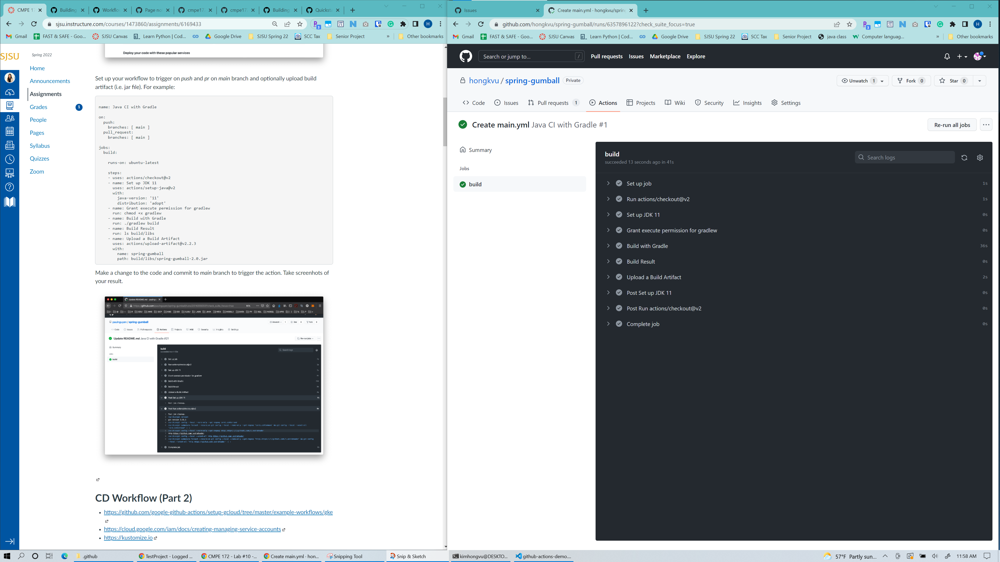

## CD Workflow (Part 2)

### Step by step
1. Set up GoogleCLoud SDK by installing the package online
2. Inside git repo, create a new workflow with GKE
    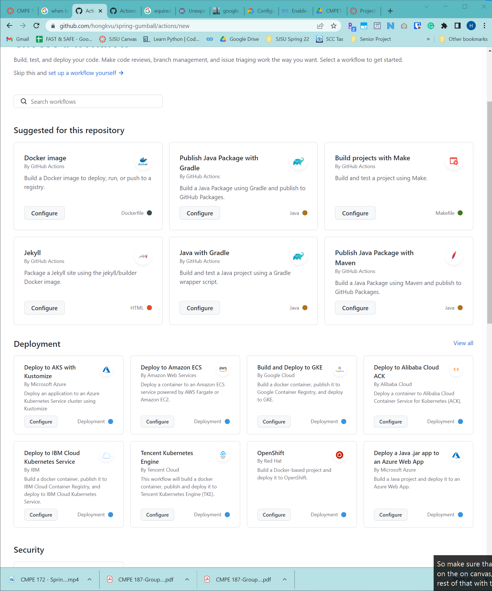
3. Add the script into the Google.yaml file
4. and commit the workflow
5. Go to Google Cloud Console, go to IAM, Go to service, and create a new service
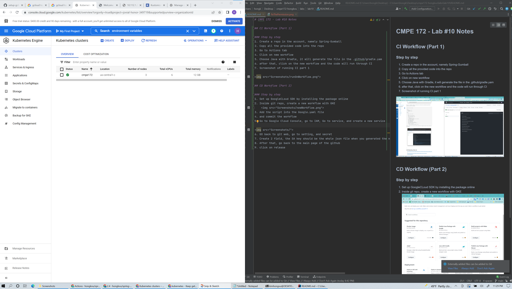
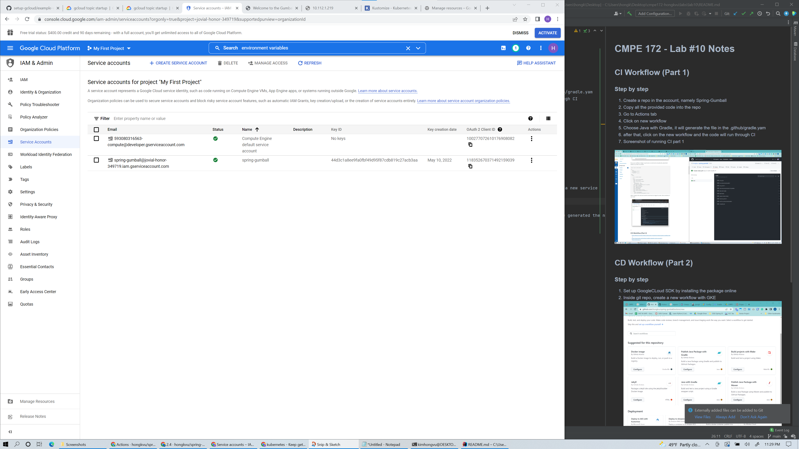
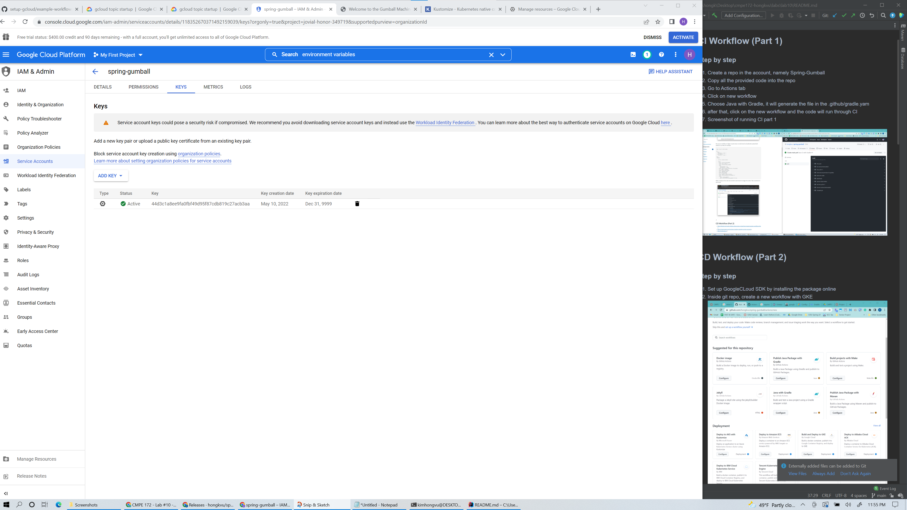
6. Go back to git web, go to setting, and secret
7. Create 2 field, the SA key should be the whole json file when you generated the new service account on GoogleCloud
 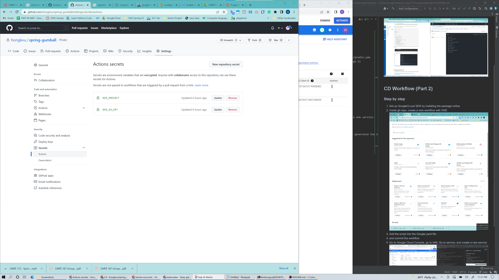
8. After that, go back to the main page of the github
9. click on release, and wait for it finish

10. Check if it success in the work flow
There was one error occur during the process, the workflow fail during configuring with the FKE cluster service
    1. The new version of GKE cluster require a permission namely: Kubernetes Engine Developer Identity and Access Management Role
    2. To deploy the application in your Kubernetes cluster, Cloud Build needs the Kubernetes Engine Developer Identity and Access Management Role.
    3. I have to do the following step to make it run
       1. enable Google Kubernetes Engine API
       2. go to terminal and run 
       3. Granting access to the service account in this link https://console.cloud.google.com/cloud-resource-manager?_ga=2.114890631.1655993451.1652215765-2064430888.1652123068&_gac=1.216278434.1652123068.EAIaIQobChMI1b77go7T9wIVph-tBh3Axgt4EAAYASAAEgJobvD_BwE
       4. 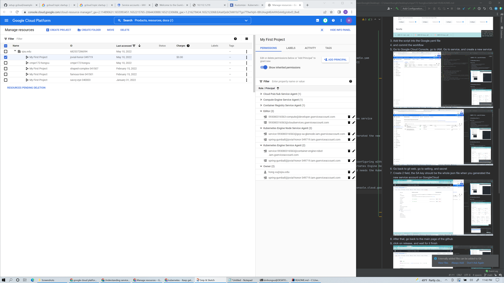
       
11. After that my project successfully load passes through CD in git repo
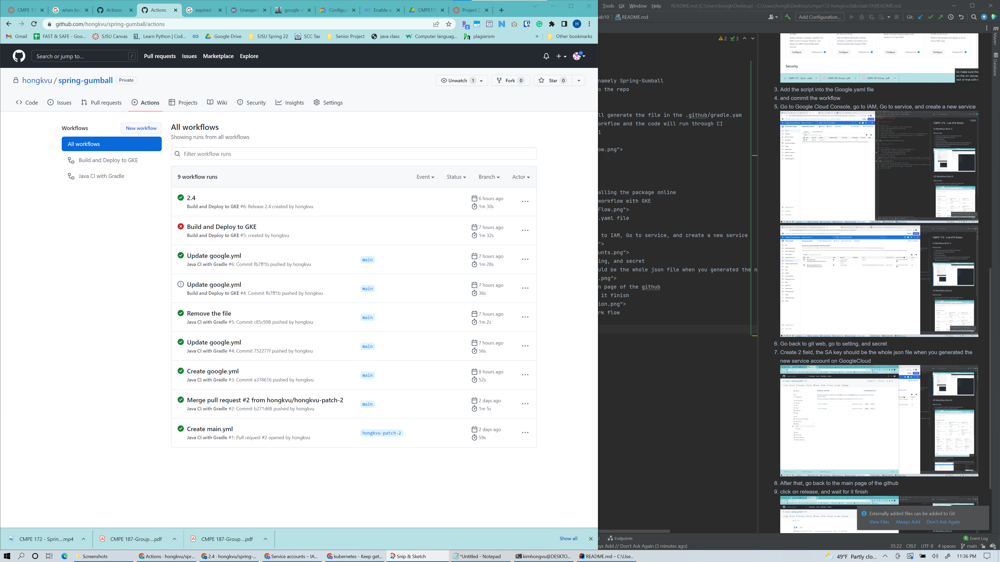

12. And now check on the GKE to see if everything is running
    1. Deployment
    2. 
    3. Service
    4. 
    5. Load balancer created it manually
    6. 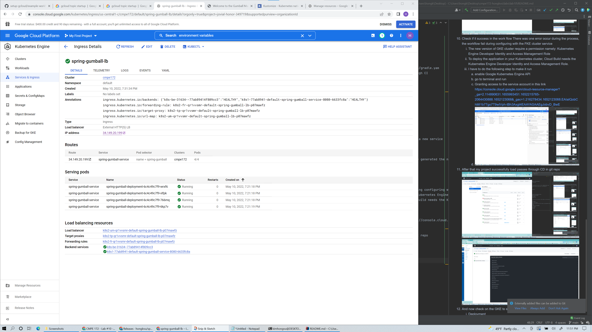
    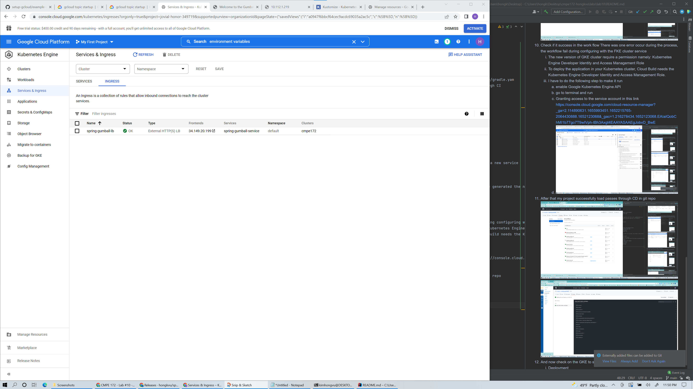
13. Finnaly the Gumball app is running
14. 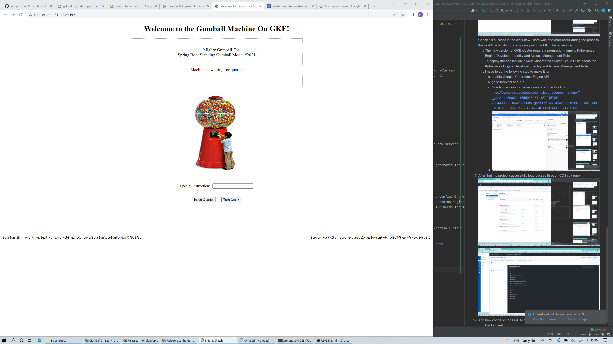